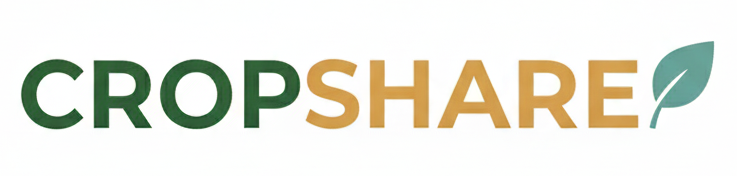

<p align="center">
  
</p>


### Key Challenges:
- **Information Asymmetry**: Farmers and NGOs lack visibility into each other's needs and availability
- **Logistical Barriers**: No streamlined system for coordinating pickups and deliveries
- **Communication Gaps**: Limited channels for direct farmer-NGO interaction
- **Resource Waste**: Surplus crops often go to waste instead of reaching those in need
- **Geographic Limitations**: Local solutions needed for fresh produce distribution

## 🎯 Solution Overview

CropShare is a comprehensive digital platform that bridges the gap between farmers and NGOs, enabling seamless crop donation and distribution workflows. The platform provides:

- **Direct Farmer-NGO Connections**: Real-time marketplace for crop listings and requests
- **Intelligent Matching**: Smart algorithms to connect surplus with need
- **Logistics Management**: Integrated pickup and delivery coordination
- **Communication Tools**: Built-in messaging and notification systems
- **Multi-language Support**: Google Translate integration for accessibility
- **Weather Intelligence**: Real-time weather alerts for crop protection
- **Role-based Dashboards**: Tailored interfaces for farmers and NGOs

## 🚀 Features & Workflows

### 1. User Authentication & Role Management
**Workflow:**
1. User registers as Farmer or NGO with profile information
2. Email verification and account activation
3. Role-based access to platform features
4. Profile management and preferences

**Technical Implementation:**
- JWT-based authentication
- Role-based middleware protection
- Secure password hashing
- Session management

### 2. Farmer Crop Management
**Workflow:**
1. Farmer logs in and accesses dashboard
2. Adds new crop listings with details (type, quantity, location, price)
3. Manages existing listings (edit, delete, update status)
4. Views incoming NGO requests
5. Approves/rejects pickup requests
6. Tracks donation history and earnings

**Key Features:**
- Image upload for crop verification
- Real-time listing status updates
- Request management interface
- Donation tracking and analytics

### 3. NGO Marketplace & Requests
**Workflow:**
1. NGO browses available crop listings
2. Filters by crop type, location, quantity
3. Sends requests to farmers with specific needs
4. Manages sent requests and responses
5. Initiates pickup scheduling for approved requests
6. Tracks ecosystem partnerships

**Key Features:**
- Advanced search and filtering
- Farmer profile viewing
- Request status tracking
- Ecosystem analytics

### 4. Real-time Communication
**Workflow:**
1. Users initiate chats from crop listings or requests
2. Real-time messaging with typing indicators
3. File/image sharing capabilities
4. Message history and archiving
5. Notification system for new messages

**Technical Implementation:**
- Socket.io for real-time communication
- Message encryption and privacy
- File upload handling
- Push notifications

### 5. Pickup & Delivery Operations
**Workflow:**
1. NGO initiates pickup request for approved crops
2. Farmer receives and responds to pickup requests
3. Logistics coordination (date, time, location)
4. Status tracking through pickup lifecycle
5. Completion confirmation and feedback

**Key Features:**
- GPS-based location coordination
- Real-time status updates
- Automated notifications
- Quality assurance checkpoints

### 6. Weather Intelligence & Alerts
**Workflow:**
1. System monitors local weather conditions
2. Generates alerts for farmers based on location
3. Weather impact analysis for crops
4. Preventive action recommendations
5. Historical weather data tracking

**Integration:**
- External weather API integration
- Location-based alerts
- Crop-specific weather recommendations

### 7. Multi-language Support
**Workflow:**
1. Automatic language detection
2. Google Translate widget integration
3. User language preferences
4. Translated UI elements and content

**Technical Implementation:**
- Google Translate API integration
- Cookie-based language persistence
- RTL language support

### 8. Dashboard Analytics
**Farmer Dashboard:**
- Crop listing performance
- Donation statistics
- Earnings tracking
- NGO connection metrics
- Weather alerts summary

**NGO Dashboard:**
- Request success rates
- Connected farmers overview
- Pickup operation status
- Ecosystem insights
- Available crop marketplace

## 🛠 Tech Stack

### Frontend
- **React 19+** - Modern UI framework
- **Vite** - Fast build tool and dev server
- **React Router** - Client-side routing
- **Axios** - HTTP client for API calls
- **Socket.io-client** - Real-time communication
- **React Icons** - Icon library
- **CSS Modules** - Component-scoped styling

### Backend
- **Node.js** - Runtime environment
- **Express.js** - Web framework
- **MongoDB** - NoSQL database
- **Mongoose** - ODM for MongoDB
- **Socket.io** - Real-time bidirectional communication
- **JWT** - Authentication tokens
- **bcryptjs** - Password hashing
- **multer** - File upload handling

### External Services
- **Google Translate** - Multi-language support
- **Weather API** - Weather data and alerts
- **Email Service** - User notifications

## 📋 Prerequisites

- Node.js 20.13.1 or higher
- MongoDB 4.4+ or MongoDB Atlas
- npm or yarn package manager


## Screenshots

### Landing Page
<p align="center">
  
</p>
The CropShare landing page introduces the platform's mission to empower farmers, support NGOs, and reduce food waste. It provides clear navigation, language toggle support (Hindi/English), and call-to-action buttons for farmers and NGOs to get started.

### Crop Marketplace
<p align="center">
  
</p>
This page displays a list of available crops shared by farmers. Users can search by crop name, farmer, or location, apply category and location filters, and view essential details such as quantity, price, and posting time.

### Interactive Map View
<p align="center">
  
</p>
The map view allows users to find crops near their location using an interactive map powered by OpenStreetMap. Each marker represents a crop listing, showing quick details like price and quantity for location-based discovery.

### Farmer Dashboard
<p align="center">
  
</p>
The farmer dashboard provides an overview of crop health alerts, weather conditions, storage suitability, and pickup or delivery status. It helps farmers track active requests and manage logistics efficiently.

### Real-time Chat Interface
<p align="center">
  
</p>
The integrated chat interface enables direct communication between farmers, buyers, and NGOs. Users can negotiate quantity, price, and pickup details in real time, ensuring transparent and efficient coordination.

### Donate to NGOs
<p align="center">
  
</p>
This section allows farmers to donate surplus crops directly to nearby NGOs. It displays verified organizations with their locations and needs, enabling farmers to contribute to food distribution and social impact initiatives.
## 🌾 Problem Statement

In many developing regions, farmers face significant challenges with crop surplus and food waste, while NGOs struggle to source fresh, locally-grown produce for their community programs. The lack of efficient platforms creates barriers between farmers who have excess crops and NGOs that need them for distribution to vulnerable populations.


## 🚀 Installation & Setup

### 1. Clone the Repository
```bash
git clone https://github.com/Chhatrapati-sahu-09/Cropshare-connect-farmers-to-NGOs.git
cd Cropshare-connect-farmers-to-NGOs
```

### 2. Backend Setup
```bash
cd server
npm install
```

Create `.env` file in server directory:
```env
PORT=5000
MONGODB_URI=mongodb://localhost:27017/cropshare
JWT_SECRET=your_jwt_secret_key
EMAIL_USER=your_email@gmail.com
EMAIL_PASS=your_email_password
WEATHER_API_KEY=your_weather_api_key
GOOGLE_TRANSLATE_API_KEY=your_google_translate_key
```

Start the backend server:
```bash
npm start
```

### 3. Frontend Setup
```bash
cd ../client
npm install
```

Create `.env` file in client directory:
```env
VITE_API_BASE_URL=http://localhost:5000/api
VITE_SOCKET_URL=http://localhost:5000
```

Start the frontend development server:
```bash
npm run dev
```

### 4. Database Setup
Ensure MongoDB is running locally or configure MongoDB Atlas connection.

## 📖 Usage

### For Farmers:
1. Register/Login as a farmer
2. Complete your profile with location and farming details
3. Add crop listings with photos and specifications
4. Monitor incoming NGO requests
5. Coordinate pickups for approved donations
6. Track your impact and earnings

### For NGOs:
1. Register/Login as an NGO
2. Set up organization profile and focus areas
3. Browse available crops in your region
4. Send requests to farmers for specific needs
5. Manage pickup logistics
6. Build and track farmer partnerships

## 🔌 API Documentation

### Authentication Endpoints
- `POST /api/auth/register` - User registration
- `POST /api/auth/login` - User login
- `GET /api/auth/profile` - Get user profile

### Crop Management
- `GET /api/crops` - Get all crops (with filters)
- `POST /api/crops` - Add new crop (farmer only)
- `PUT /api/crops/:id` - Update crop
- `DELETE /api/crops/:id` - Delete crop

### Request Management
- `GET /api/requests` - Get user requests
- `POST /api/requests` - Send crop request
- `PUT /api/requests/:id` - Update request status

### Messaging
- `GET /api/messages/:userId` - Get conversation
- `POST /api/messages` - Send message
- `GET /api/messages/unread` - Get unread count

### Pickup Operations
- `GET /api/pickups` - Get pickups for user
- `POST /api/pickups` - Create pickup request
- `PUT /api/pickups/:id` - Update pickup status

## Screenshots

### Landing Page
<p align="center">
  
</p>
The CropShare landing page introduces the platform's mission to empower farmers, support NGOs, and reduce food waste. It provides clear navigation, language toggle support (Hindi/English), and call-to-action buttons for farmers and NGOs to get started.

### Crop Marketplace
<p align="center">
  
</p>
This page displays a list of available crops shared by farmers. Users can search by crop name, farmer, or location, apply category and location filters, and view essential details such as quantity, price, and posting time.

### Interactive Map View
<p align="center">
  
</p>
The map view allows users to find crops near their location using an interactive map powered by OpenStreetMap. Each marker represents a crop listing, showing quick details like price and quantity for location-based discovery.

### Farmer Dashboard
<p align="center">
  
</p>
The farmer dashboard provides an overview of crop health alerts, weather conditions, storage suitability, and pickup or delivery status. It helps farmers track active requests and manage logistics efficiently.

### Real-time Chat Interface
<p align="center">
  
</p>
The integrated chat interface enables direct communication between farmers, buyers, and NGOs. Users can negotiate quantity, price, and pickup details in real time, ensuring transparent and efficient coordination.

### Donate to NGOs
<p align="center">
  
</p>
This section allows farmers to donate surplus crops directly to nearby NGOs. It displays verified organizations with their locations and needs, enabling farmers to contribute to food distribution and social impact initiatives.

## 🚀 Future Enhancements

We're continuously working to improve CropShare and expand its capabilities. Here are some planned enhancements:

### 💳 Online Payment Integration
- Secure payment processing for crop purchases
- Multiple payment methods (UPI, cards, net banking)
- Transaction history and receipts
- Revenue tracking for farmers

### 📦 Order Tracking System
- Real-time GPS tracking for pickups and deliveries
- ETA predictions and route optimization
- Delivery confirmation with photos
- Automated status updates via SMS/email

### 🏛️ Government Scheme Integration
- Integration with agricultural subsidy programs
- Automatic eligibility checking
- Scheme benefit tracking and reporting
- Government certification verification

### 🤖 AI-based Price Recommendations
- Machine learning models for fair pricing
- Market trend analysis and predictions
- Crop quality assessment for pricing
- Dynamic pricing based on demand and supply

### 🌐 Regional Language Support
- Support for major Indian languages (Hindi, Tamil, Telugu, etc.)
- Voice-based input and commands
- Localized content and notifications
- Cultural adaptation for different regions

## 🤝 Contributing

1. Fork the repository
2. Create a feature branch (`git checkout -b feature/AmazingFeature`)
3. Commit your changes (`git commit -m 'Add some AmazingFeature'`)
4. Push to the branch (`git push origin feature/AmazingFeature`)
5. Open a Pull Request

### Development Guidelines
- Follow ESLint configuration
- Write meaningful commit messages
- Test API endpoints thoroughly
- Maintain component documentation
- Ensure responsive design

## 📄 License

This project is licensed under the MIT License - see the [LICENSE](LICENSE) file for details.

## 🙏 Acknowledgments

- Farmers and NGOs for their invaluable input
- Open source community for amazing tools and libraries
- Weather API providers for environmental data
- Google Translate for accessibility features

## 📞 Support

For support, email support@cropshare.com or join our Discord community.

---

**Built with ❤️ for sustainable agriculture and community welfare**" 
